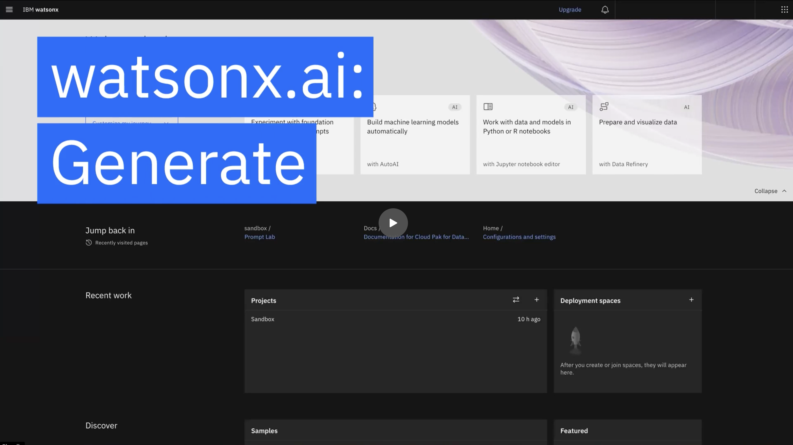
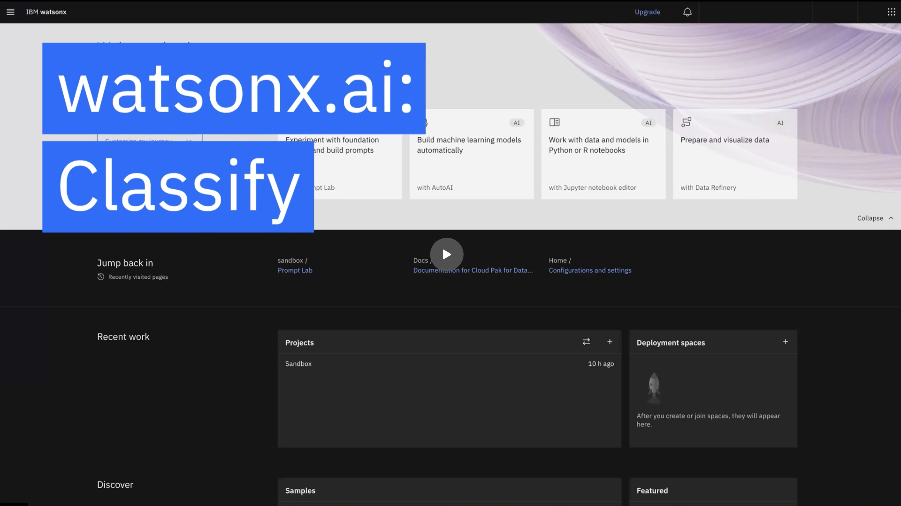
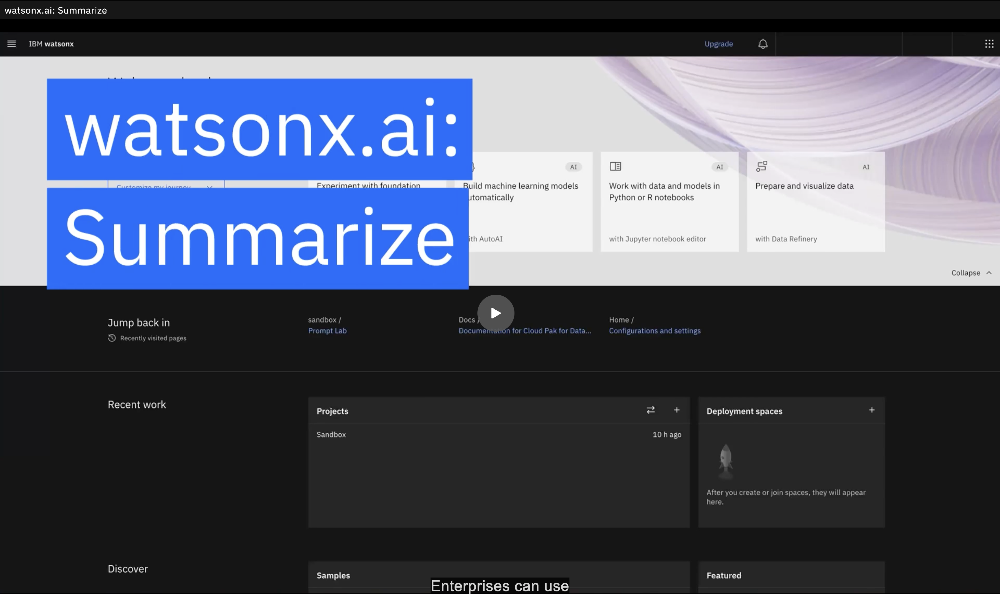
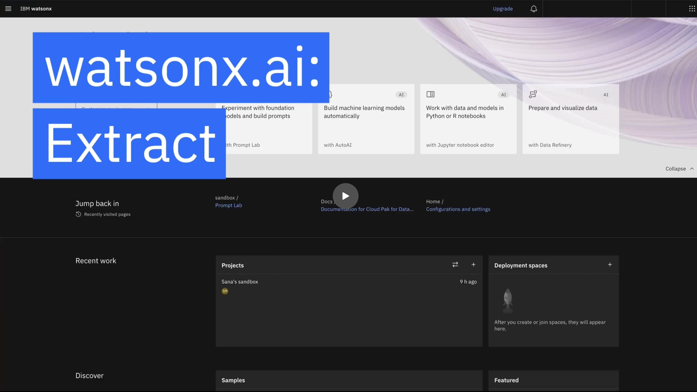

# Main use cases of prompt engineering

When crafting prompts, watsonx.ai supports four high-level capabilities: **Generate**, **Classify**, **Summarize**, and **Extract**. Examples of these four capabilities include drafting job descriptions, classifying customer complaints, summarizing complex regulatory documents, and extracting key business information.

When testing your prompts, you can choose from a collection of IBM models or other [open source models](https://huggingface.co/models). 

Once comfortable enough, you can proceed with tuning models for certain business needs to address a specific capability or task in a specialized manner. 

## 1: [Generate](#generate)

The Prompt Lab that we will explore offers examples for these use cases. For generating, one can generate emails for marketing and customer personas, for example.

### 1a: [Generate a marketing email](#generate-marketing-email)
Good prompts specify several details regarding the email’s desired characteristics, including the company, what the offer entails, the tone, and any particular deadlines in mind. We’ll explain more in the first lab.

### 1b: [Create a thank you note](#create-thank-you-note)
We would describe the context similarly, including the kind of recipient(s), the top, and the tone. 

## 2: [Classify](#classify)
watsonx.ai is capable of reading and classifying written input, with as few as zero examples. Examples include evaluating and sorting customer complaints or reviewing customer feedback sentiment.

### 2a: [Classify a scenario to describe a project](#classify-scenario)
Say if you were provided several project categories and needed a simple single classification, one could provide the category and description for each and let the model generate a single description.

### 2b: [Classify a sentiment as positive or negative](#classify-sentiment)
Sentiment and tone analysis are also common use cases when operationalizing large pieces of text. After providing the model a certain review you’d like to judge, simply let it return a classification from the options you provide.

## 3: [Summarize](#summarize)
Transform dense text into your personalized executive overview with the help of watsonx.ai, like capturing key points from financial reports, meetings transcriptions, and more.

### 3a: [Summarize a meeting transcript](#summarize-meeting-transcript)
If we were to summarize a meeting transcript, simply paste in the transcript text and instruct the model to summarize, specifying any specific details or characteristics you want to highlight.

## 4: [Extract](#extract)
With watsonx.ai, you can sort through complex details quickly and pull the information you want form large documents. Extract information such as identifying named entities, parsing terms and conditions, and more.

### 4a: [Extract a named entity](#extract-named-entity)
An example could be extracting a certain entity from a text passage. In this case, you can provide the model the passage’s text and ask it to extract any entities it detects.

### 4b: [Extract a fact from an SCC 10-k filing](#extract-fact)
The models work great on extracting quantitative facts and data as well. 

