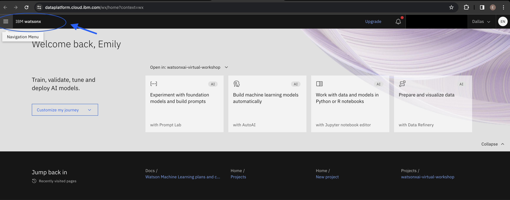
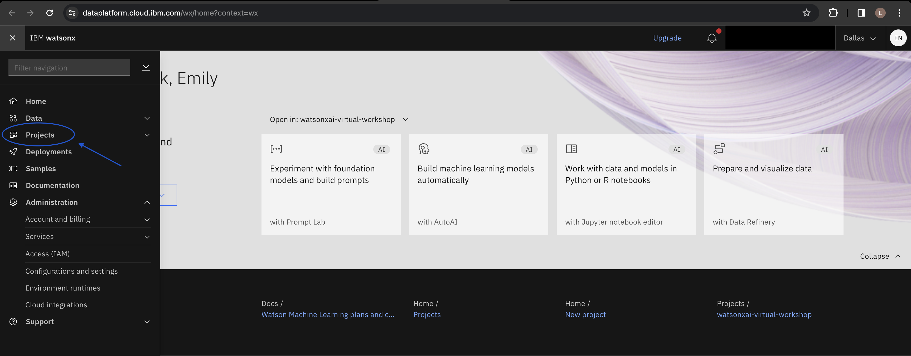
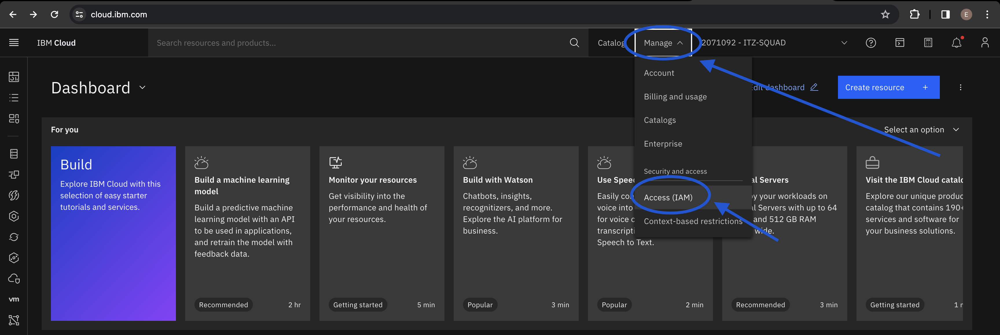
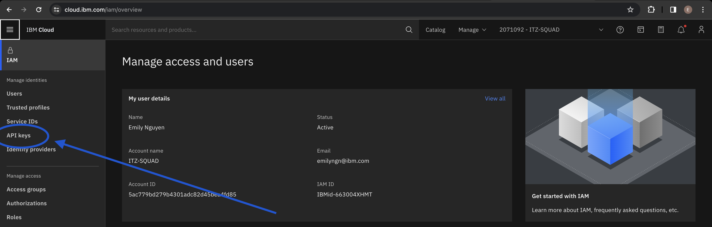
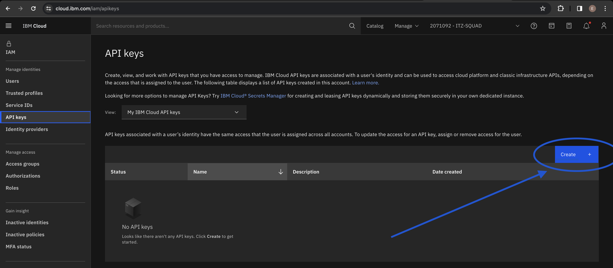
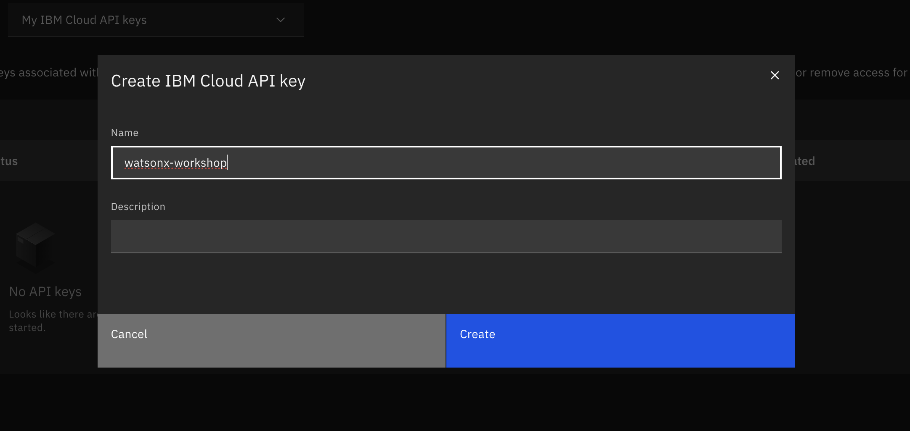
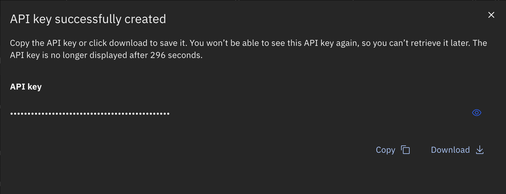

# Environment Setup

There are a few steps that need to be completed on your end to successfully complete the labs.

## 1. [Visit the watsonx.ai Project](#visit-watsonxai)
Ensure that you can log into to watsonx.ai using this link: https://dataplatform.cloud.ibm.com/wx/. You will use the watsonx.ai interface for these two labs focused on Prompt Engineering.

## 2. Once there, click on the left-side menu. 

## 3. Select the dropdown arrow next to `Projects` .

## 4. Select `View all projects`.

You should see a project called `watsonxai-virtual-workshop` in the list. If so, you are on the right track!

## 5. [Obtain an IBM Cloud API Key](#api-key)
We will be following [these instructions](https://cloud.ibm.com/docs/account?topic=account-userapikey&interface=ui#create_user_key) to create an API Key. You will need this key for Lab 2.

## 6. Visit cloud.ibm.com. At the top right, select the `Manage` dropdown, then select `Access (IAM)`.

## 7. In the left-side menu, select `API Keys`.

## 8. Click `Create` to create your API Key.

## 9. You can name your API Key however you'd like.

Note: Make sure to save it somewhere in your device upon creation. You will not be able to retrieve it after closing the pop-up! (You can always generate a new key if you did happen to lose it, however).

