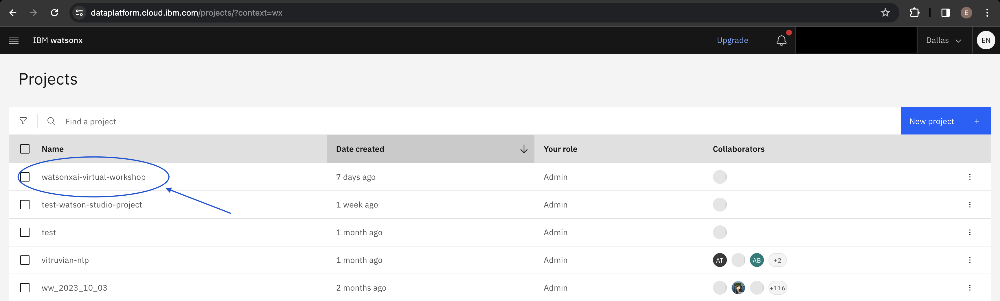

# Environment Setup

There are a few steps that need to be completed on your end to successfully complete the labs.

## 1. [Create an IBMid](#create-id)
Go to this link here to create an IBMid: https://www.ibm.com/account/reg/us-en/signup?formid=urx-19776.

## 2. [Check email and join invitation to the IBM Cloud instance] (#check-email)
You should have received an invitaion via email with the subject "Action required: You are invited to join an account in IBM Cloud." If so, click **Join Now**.

If you did not receive the email, wait a few minutes and refresh the page. Otherwise, go to step 4.

## 3. [Check email and join the Watson Studio project] (#watson-studio)
You should have received another email noifying you that you have been "invited to join a project on Watson Studio." If so, click **Join Now**. If those two emails have shown up, you can skip to step 5.

## 4. [Create IBM Cloud Account](#ibm-cloud)
If you did not receive the emails from Steps 2 and 3, go to this link to create an IBM Cloud Account using the same email as in Step 1: https://cloud.ibm.com/registration.

**Note:** When creating your ID, it might ask you for a Company affiliation. You can just write "Personal" there.

## 5. [Visit the watsonx.ai Project](#visit-watsonxai)
Ensure that you can log into to watsonx.ai using this link: https://dataplatform.cloud.ibm.com/wx/. You will use the watsonx.ai interface for these two labs focused on Prompt Engineering.

## 6. Once there, click on the left-side menu. 

## 7. Select the dropdown arrow next to `Projects` .

## 8. Select `View all projects`.

You should see a project called `IBM-DSU` in the list. If so, you have successfully been invited to the project!

