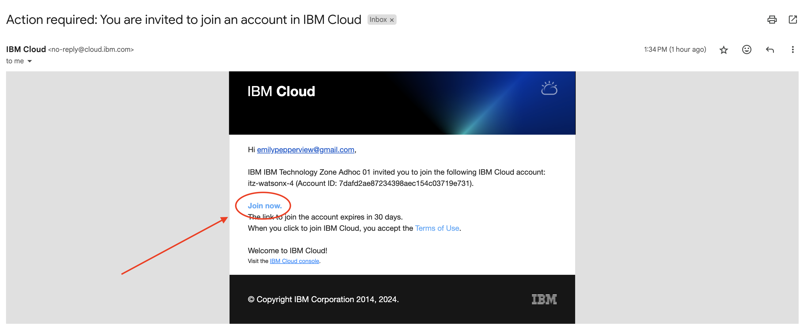
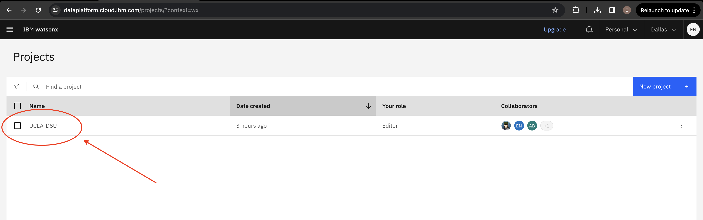

# Environment Setup

  - [1: Create an IBMid ](#create-ibm-id)
  - [2: Check your email and join invitation to the IBM Cloud instance ](#check-email)
  - [3: Check your email and join the Watson Studio project ](#watson-studio)
  - [4: Create IBM Cloud Account ](#ibm-cloud)
  - [5: Visit the watsonx.ai Project ](#visit-watsonxai)

## 1. Create an IBMid 
Follow this link to create an IBMid: https://www.ibm.com/account/us-en/signup/register.html.

## 2. Check your email and join invitation to the IBM Cloud instance 
You should have received an invitaion via email with the subject "Action required: You are invited to join an account in IBM Cloud." If so, click **Join Now**.

If you did not receive the email, wait a few minutes and refresh the page. Otherwise, go to step 4.

## 3. Check your email and join the Watson Studio project 
You should have received another email noifying you that you have been "invited to join a project on Watson Studio." If so, click **Join**. If the email from Step 2 and this email have appeared, skip to [Step 5](#visit-watsonxai).

## 4. Create IBM Cloud Account 
If you did not receive the emails from Steps 2 and 3, go to this link to create an IBM Cloud Account using the same email from Step 1: https://cloud.ibm.com/registration.

**Note:** When creating your ID, it might ask you for a Company affiliation. You can just write "Personal" there.

## 5. Visit the watsonx.ai Project 
Ensure that you can log into to watsonx.ai using this link: https://dataplatform.cloud.ibm.com/wx/. You will use the watsonx.ai interface for the labs focused on Prompt Engineering.

## Once there, click on the left-side menu. 

## Select the dropdown arrow next to `Projects` .

## Select `View all projects`.

You should see a project called `UCLA-DSU` in the list. If so, you have successfully been invited to the project!

