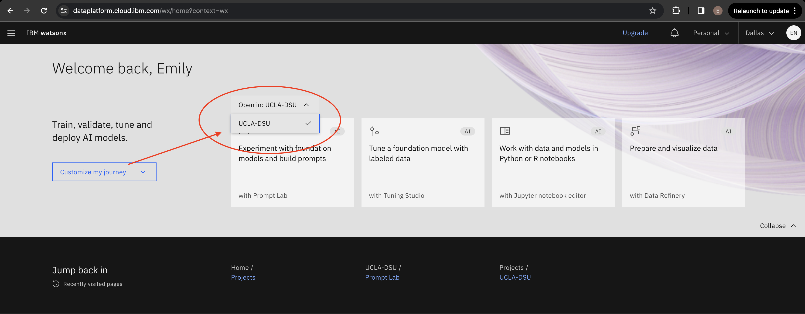
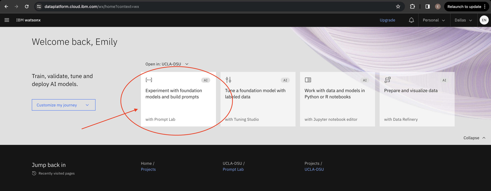

# Lab 1: Prompt Lab

To get started with prompt engineering, visit the IBM watsonx.ai page: https://dataplatform.cloud.ibm.com/wx/.

Select project `UCLA-DSU` in the dropdown menu.

Clock on the Prompt Lab tab.

### Read over the following exercises
1. [Basics of Prompt Engineering](./prompt-engineering/prompt-engineering-basics.md)
2. [Creating prompts in watsonx.ai's Prompt Builder](./prompt-engineering/prompt-engineering-exercises.md)
3. [Creating prompts with content](./prompt-engineering/prompt-with-content-exercises.md)
