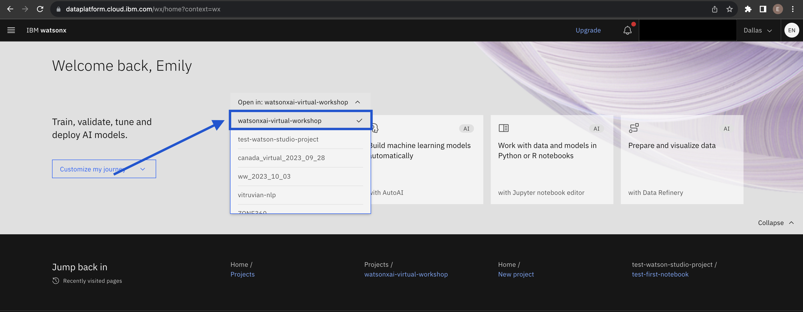
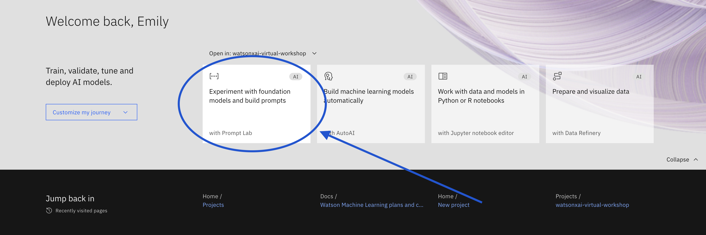

# Lab 1: Prompt Lab

To get started with prompt engineering, visit the Prompt Lab [here](https://dataplatform.cloud.ibm.com/wx/).

Note that for self-study and customer demos, when able, we will be using the watsonx.ai GA environment. Be mindful of token constraints that limit the amount of sessions you can have with watsonx.ai — [they vary depending on pricing tier](./pricing.md).

Select project `watsonxai-virtual-workshop` in the dropdown menu.

Clock on the Prompt Lab tab.

### Complete the following exercises
1. [Basics of Prompt Engineering](./prompt-engineering/prompt-engineering-basics.md)
2. [Creating prompts in watsonx.ai's Prompt Builder](./prompt-engineering/prompt-engineering-exercises.md)
3. [Creating prompts with content](./prompt-engineering/prompt-with-content-exercises.md)
