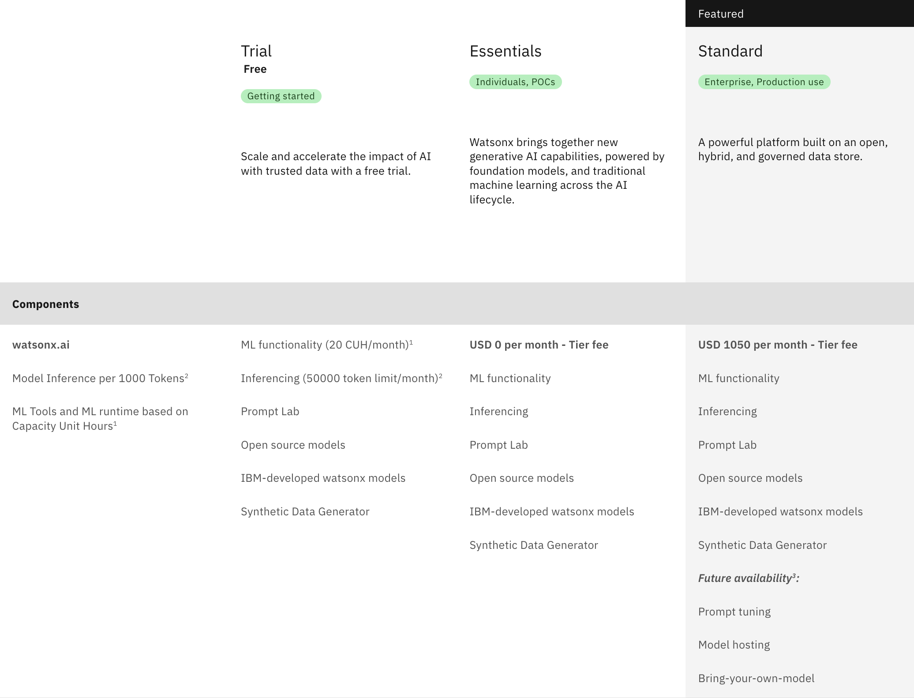
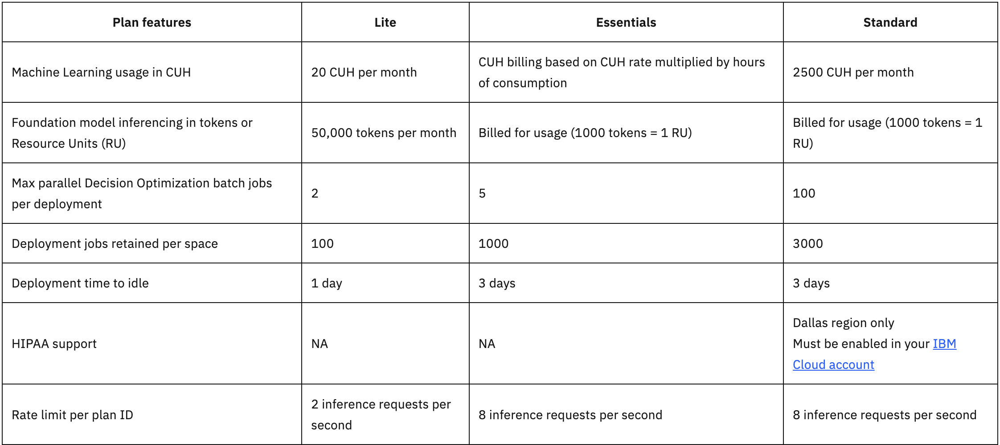
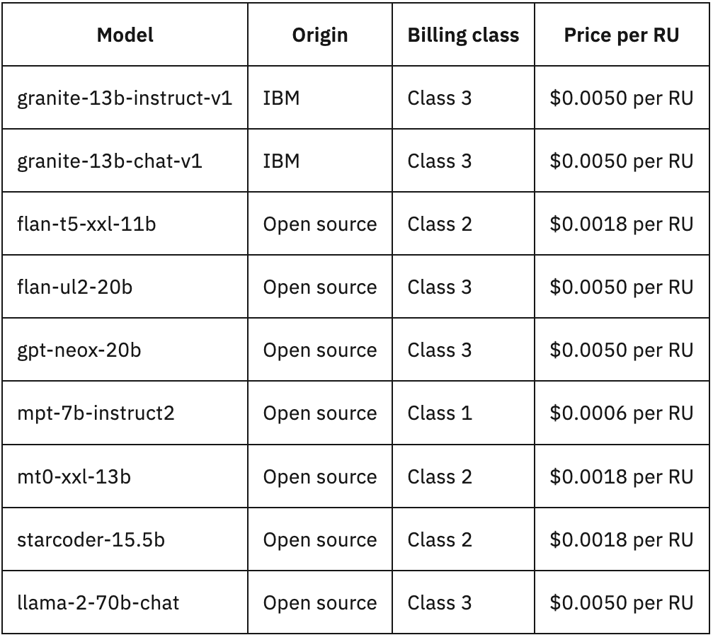

# watsonx.ai Pricing

watsonx.ai has different [pricing tiers](https://www.ibm.com/products/watsonx-ai/pricing) depending on the use case. IBM currently has 3 SaaS offerings: **Free**, **Essentials**, and **Standard**.

The differences in these pricing plans mainly depends on the consumption of resources allotted to you. Two important resources are the [Watson Machine Learning Service and Inferencing](https://dataplatform.cloud.ibm.com/docs/content/wsj/getting-started/wml-plans.html?context=wx&audience=wdp). 

### Watson Machine Learning (WML)
- Machine learning is a big part of training, running, and deploying large-language models. Choose the free plan if you are evaluating Watson Machine Learning and want to try out the capabilities.

- The free trial limits the amount of Watson Machine Learning Service resources you can use per hour, measured in `capacity unit hours (CUH)`.

 
### Inferencing 

- Inferencing is another important part in evaluating models, is also limited in the amount of live [data you can run through trained AI models](https://research.ibm.com/blog/AI-inference-explained) to make predictions or solve certain tasks. It is measured in `resource units (RU)`. 

## Free Trial Plan
For getting started. 

The free trial offers most of the platform’s features but at limited use. For example, it has a 50,000 monthly token limit that essentially restricts the amount of sessions users can have in watsonx.ai. 

| **WML Consumption**        | **Inferencing Consumption** |
|-----------------|-------------------|
| 20 CUH per month  | 1 RU = 1,000 of the 50,000 monthly tokens | 

Note: For internal IBMers, we receive the free plan by default. However IBMers can exploit benefits from the higher plans for free using IBM Research’s [BAM service](https://bam.res.ibm.com/). This can be useful for heavy-weight demos and other internal projects as it has access to more open-source models that aren't GA, unlimited tokens, etc.  

## Essentials Plan

For individuals and POCs. 

| **WML Consumption**        | **Inferencing Consumption** |
|-----------------|-------------------|
| Pay-as-go basis (CUH rate * number of consumption hours)  | Pay-as-go basis   1 RU = 1,000 of the 50,000 monthly tokens | 

## Standard Plan

For enterprise and production use. 

| **WML Consumption**        | **Inferencing Consumption** |
|-----------------|-------------------|
| 2500 CUH per month  | Pay-as-go basis   1 RU = 1,000 of the 50,000 monthly tokens | 

# watsonx.ai Software Pricing

watsonx.ai software will be GA in 4Q’23. Features include the same capabilities as the Essentials plan without the Prompt Lab interface.
