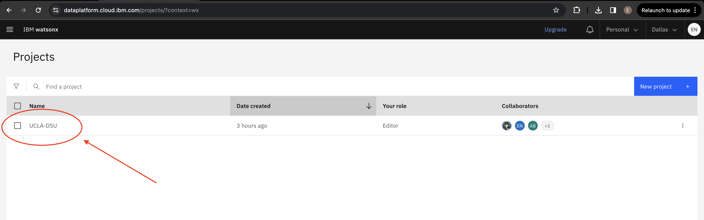
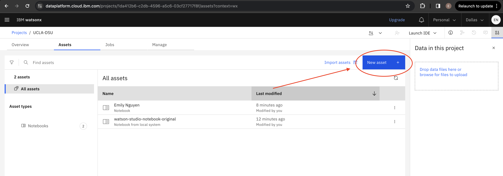
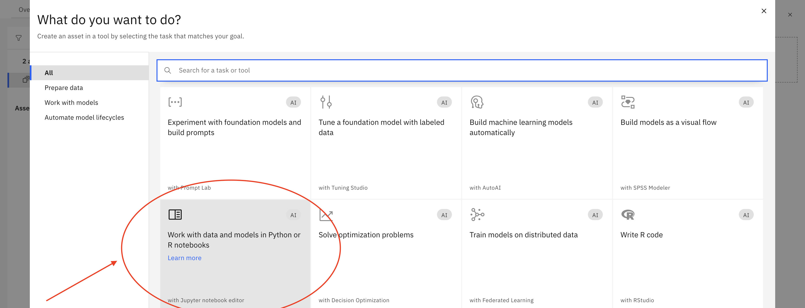
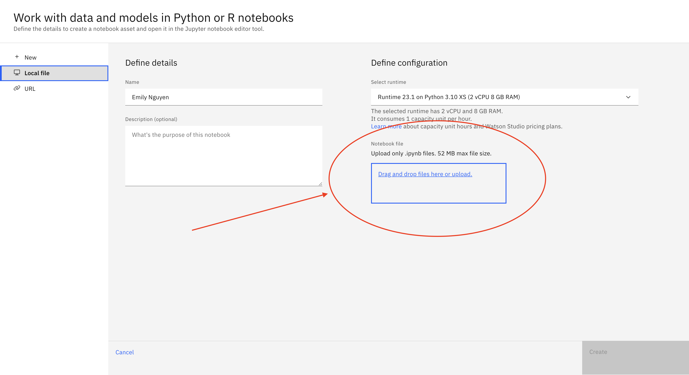

# Prompt Engineering Challenge Exercises

## 1: Introduction
Playing in the Prompt Lab showcases only part of watsonx.ai’s full potential. Now that we have a strong foundation of Prompt Lab basics, we can go ahead and start calling LLMs using the Python client SDK. 

## 2: Visit https://dataplatform.cloud.ibm.com/projects/?context=wx like we did in [Lab 0](../lab-0/README.md).

## 3: Click on our project called `UCLA-DSU`.

The first thing you land on is the Overview page. This records some helpful information about the project, including how many tokens, CUH, and resource units we mentioned when dicussing [pricing tiers](../lab-1/pricing.md).

## 4: Click on the `Assets` tab. 

## 5. Import notebook
Download the notebook [here](./watson-studio-notebook.ipynb) and import it.

### Click *New asset*.

### Click *Work with data and models in Python or R notebooks*.

### Name it as *<first_name last_name>* and upload the notebook.

You can now work on the notebook!

Otherwise if you couldn't import the notebook, follow steps 6-7.

## 6: Make a copy of the original notebook.

Make a copy of the notebook below by clicking the 3 dots. You may need to refresh the page to see the effect.

## 7: Rename the notebook to your first and last name.
After duplicating the notebook, 

1. Refresh the page.
2. Click the three dots again, then click `Edit`.
3. Rename the notebook to `<first_name last_name>` by clicking the info icon on the top right and selecting the *Edit* icon to rename the file. Make sure to follow this naming convention, as all participants’ notebooks will be visible and located here. Opening the notebook might take some time to wait for the runtime to finishing loading.

In this notebook you will find a few exercises involving various prompt engineering exercises using the Python client. Each question has a suggested result to compare your prompt output against.