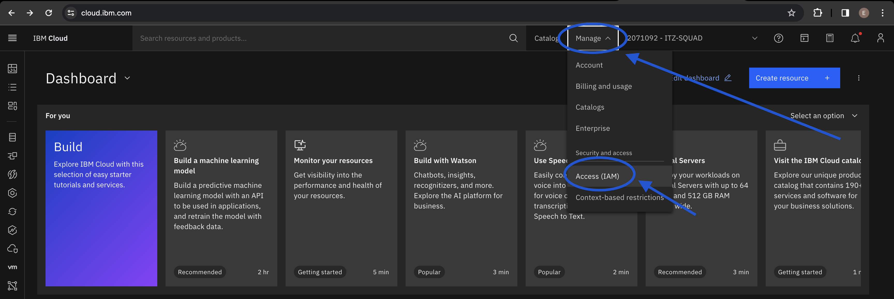
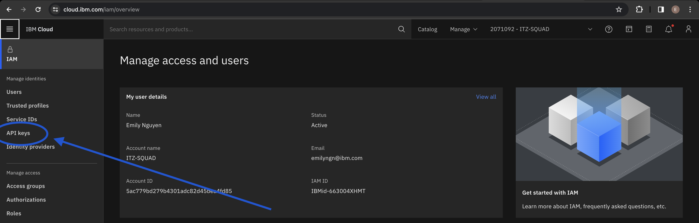
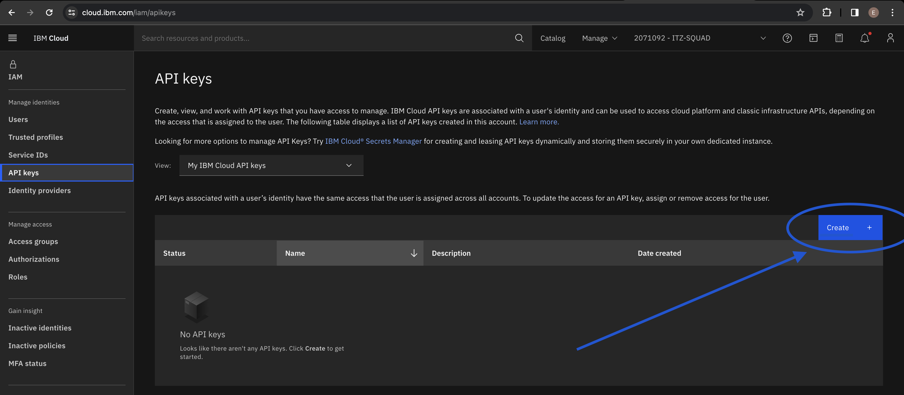
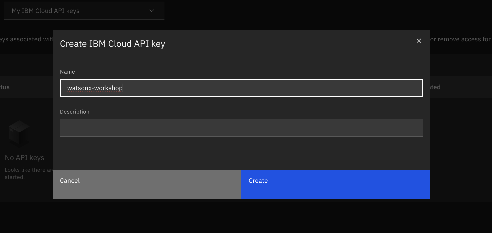
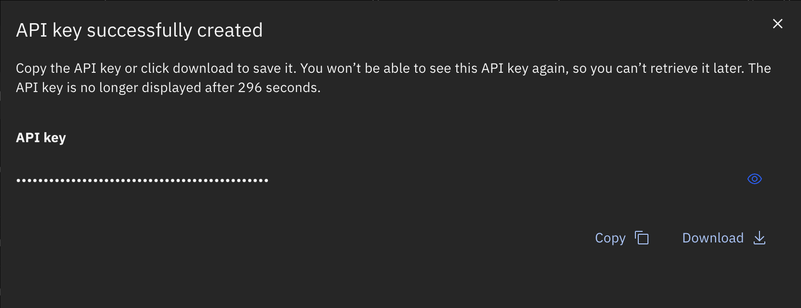

# Obtain an IBM Cloud API Key
We will be following [these instructions](https://cloud.ibm.com/docs/account?topic=account-userapikey&interface=ui#create_user_key) to create an API Key.

## Visit cloud.ibm.com. At the top right, select the `Manage` dropdown, then select `Access (IAM)`.

## In the left-side menu, select `API Keys`.

## Click `Create` to create your API Key.

## You can name your API Key however you'd like.

**Note:** Make sure to save it somewhere in your device upon creation. You will not be able to retrieve it after closing the pop-up! (You can always generate a new key if you did happen to lose it, however).
